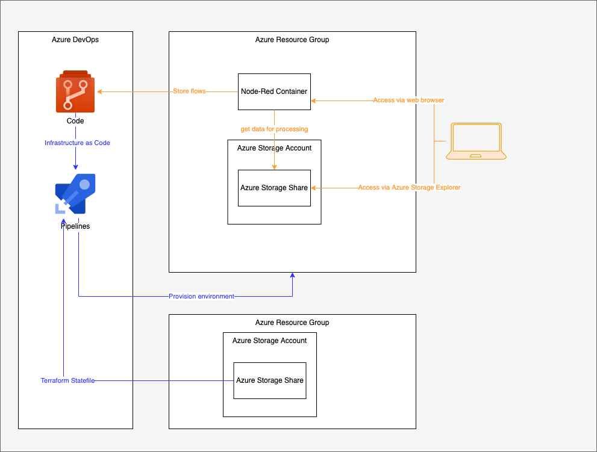

# Node-RED instance running on Azure

```bash
terraform init -backend-config=azure.conf
bash ../../common/workspacetest.sh tst
terraform plan -out out.plan
terraform apply out.plan

terraform plan -destroy -out out.plan
terraform apply out.plan
```


