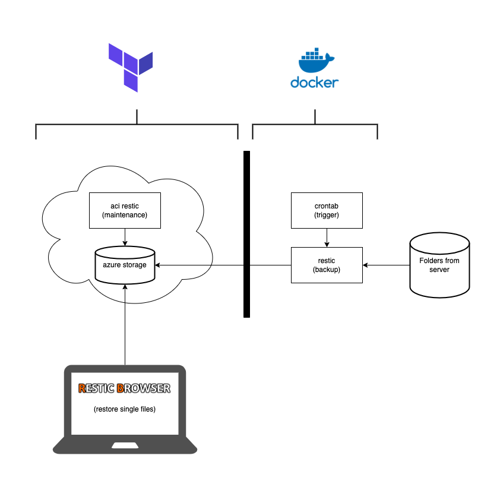

# Restic backup with Azure

This example explains how to automatically backup data with [restic](https://restic.net/) to Microsoft Azure.



## Quick intro

Of course, we are making use of terraform. Ensure `azure.conf` and `terraform.tfvars` are there and the specified tf container exists on the azure storage.

```bash
terraform init -backend-config=azure.conf
bash ../../common/workspacetest.sh tst
terraform plan -out out.plan
terraform apply out.plan

terraform plan -destroy -out out.plan
terraform apply out.plan
```

When you apply the terraform script, the necessary infrastructure is created.

## Step 1: backup your data with restic

In my scenario, there is a Docker-based environment onsite. Restic is running within a docker container, which is triggered regularly via [docker-crontab](https://github.com/willfarrell/docker-crontab).

To initialize restic and backup stuff, see [Microsoft Azure Blob Storage](https://restic.readthedocs.io/en/latest/030_preparing_a_new_repo.html#microsoft-azure-blob-storage).

Set keys for manual setup

```bash
export AZURE_ACCOUNT_NAME=<ACCOUNT_NAME>
export AZURE_ACCOUNT_KEY=<SECRET_KEY>
```

Prepare target. Ensure to have the environments variables above set.

```bash
restic -r azure:backup:/ init
```

Backup data manually.

```bash
restic -r azure:backup:/ --verbose backup /data/buecher
```

Backup with scheduled plan, I'm using [docker-crontab](https://github.com/willfarrell/docker-crontab) for that purpose.

```bash
docker exec restic /usr/bin/restic --verbose=3 backup /data/buecher-archiv
```

See Snapshots

```bash
docker exec restic /usr/bin/restic snapshots
restic snapshots
```

## Step 2: backup maintenance

Occasionally, you should clean up old snapshots. This can get very, very, costly when the backup is located on Azure or other cloud services. Often storing data is nearly free, but reading data is expensive. For the maintenance tasks, a lot of data needs to be read. So, I'm doing this from within an Azure Container Instance which is located close to the actual storage (same resource group). On the one hand, this is rapid, and it also seems nearly free compared to a maintenance process where you get all the data from the storage to re-organize it.

The Azure Container Instance which is part of this terraform example contains this command to do the maintenance stuff. After the job has been done, the ACI exits. You can start it whenever needed to re-run it again.

```tf
commands = ["sh","-c","restic forget --keep-last 1 --prune"]
```

## Step 3: browse repo and restore single files

I'm using [restic-browser](https://github.com/emuell/restic-browser) for this task.

If the tool complains about restic not being part of your $Path, this is the path to executable on macOS:

```bash
/usr/local/bin/restic
```

You have to provide the following credentials for restic-browser UI:

```text
Type: Azure Blob Storage
Bucket: backup:/
AZURE_ACCOUNT_NAME:
AZURE_ACCOUNT_KEY:
Repository Password:
```

If you want to check your backup repository from any other place where you have a restic executable installed, ensure to export these environment variables first, and then you can run any restic command directly e.g. `restic snapshots`.

```bash
export AZURE_ACCOUNT_NAME=<ACCOUNT_NAME>
export AZURE_ACCOUNT_KEY=<SECRET_KEY>
export RESTIC_PASSWORD=<RESTIC_PASSWORD>
export RESTIC_REPOSITORY=<RESTIC_REPOSITORY>
```
