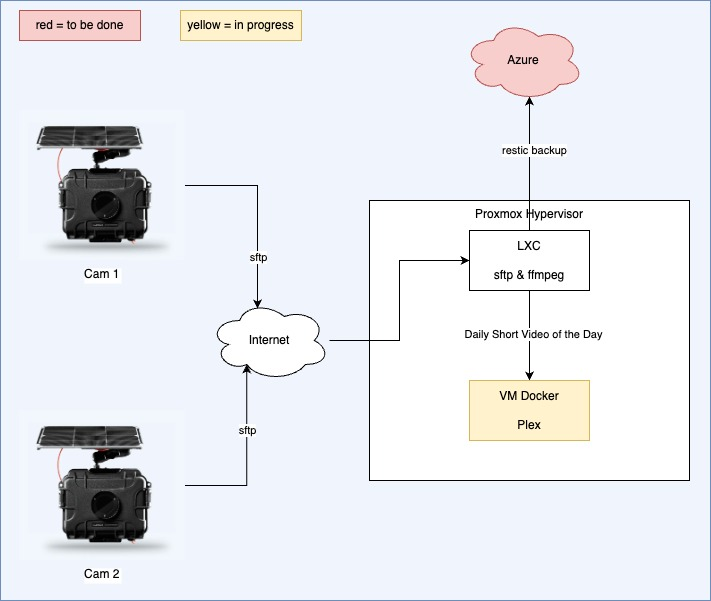

# Azure DevOps in LCX Container on Proxmox

- [Quick intro](#quick-intro)
- [Infrastructure](#infrastructure)
- [Specific instructions for some stacks](#specific-instructions-for-some-stacks)
  - [USB Pass-through for RTL-SDR](#usb-pass-through-for-rtl-sdr)
    - [Flightradar24](#flightradar24)
    - [ADSBexchange](#adsbexchange)

## Quick intro

Ensure `azure.conf` and `terraform.tfvars` are there and the specified tf container exists on the azure storage.

```bash
terraform init -backend-config=azure.conf
bash ../../common/workspacetest.sh tst
terraform plan -out out.plan
terraform apply out.plan

terraform plan -destroy -out out.plan
terraform apply out.plan # destroying used to fail when container was turned off
```

## Infrastructure

Terraform creates infra on Proxmox. Requirements:

- Terraform user with atequate permissions

```bash
pveum role add TerraformProv -privs "Datastore.AllocateSpace Datastore.Audit Pool.Allocate Sys.Audit Sys.Console Sys.Modify VM.Allocate VM.Audit VM.Clone VM.Config.CDROM VM.Config.Cloudinit VM.Config.CPU VM.Config.Disk VM.Config.HWType VM.Config.Memory VM.Config.Network VM.Config.Options VM.Migrate VM.Monitor VM.PowerMgmt"
pveum user add terraform-prov@pve --password <Password>
pveum aclmod / -user terraform-prov@pve -role TerraformProv
pveum user list --full
```

Adjust role permissions if needed:

```bash
pveum role modify TerraformProv -privs "Datastore.AllocateSpace Datastore.Audit Pool.Allocate Sys.Audit Sys.Console Sys.Modify VM.Allocate VM.Audit VM.Clone VM.Config.CDROM VM.Config.Cloudinit VM.Config.CPU VM.Config.Disk VM.Config.HWType VM.Config.Memory VM.Config.Network VM.Config.Options VM.Migrate VM.Monitor VM.PowerMgmt"
```

## Specific instructions for some stacks

### Cam-Do setup

Do capture images from [Cam-Do](https://cam-do.com/) or any other remote devices, I have setup the following infratsructure. The required scripts are also located in this repo.

One camera setup consists of these devices:

- Waterprof and resistant Cam-Do enclosure including 2 solar panals (not yert sure if they are sufficent to overcome wintertime)
- Cam-Do UpBlink controller including battery pack
- GoPro Hero 11
- LTE 4G USB mobile modem with additional device SIM for my providers plan I have anyway



For diagnostics, the sub-folder `status` accepts a `sendlogs.txt` file that triggers an upload of the log file. You can also update UpBlink's firmware by putting the .zip file in the status folder.

```bash
for dir in /data/UpBlink-*/; do
    touch "${dir}status/sendlogs.txt"
done
```

In order to remotely update the capture schedule, you would need to upload a `schedules.json` file into the `status` folder that UpBlink uploads to on your FTP server. If the update is successful, the file will be renamed `successful_schedules.json`.

Add the `install-script\timelapse.sh` script to the crontab to create a video each day. Run `crontab -e` and add or edit the following line:

```bash
0 19 * * * /data/timelapse.sh all test
```

Review crontab: `crontab -l`

Check the status of the script with `systemctl status cam-do-schedule`.

### Permanent USB permissions through reboots

Run `cat > /etc/udev/rules.d/99-usb-device.rules` on the Proxmox host:

```conf
# Realtek RTL2838 DVB-T
SUBSYSTEM=="usb", ATTRS{idVendor}=="0bda", ATTRS{idProduct}=="2838", MODE="0666",SYMLINK+="rtl2838_dvb_t"
```

The  run `udevadm control --reload-rules && udevadm trigger`. Once you've done this, a symlink named `rtl2838_dvb_t` should appear in the `/dev` directory, pointing to your device. This symlink will persist across reboots, allowing you to reliably reference the device.

### USB Pass-through for RTL-SDR

Sources:

- [USB Passthrough to an LXC (Proxmox)](https://medium.com/@konpat/usb-passthrough-to-an-lxc-proxmox-15482674f11d)
- [Forum: Proxmox LXC - Ubuntu 18.04 - USB Passthrough](https://forum.flightradar24.com/forum/radar-forums/flightradar24-feeding-data-to-flightradar24/216300-proxmox-lxc-ubuntu-18-04-usb-passthrough)

1. Create LXC

First of all create the container, either manual or with the provided terraform script. Key metric:
    - OS: Debian
    - CPU: 1
    - Disk: 8GB
    - Memory: 1GB

To setup all the required packages, run the install script: [flightradar.sh](install-scripts/flightradar.sh). The script is automatically run, when setting up the container with terraform. If you prefer manual setup, repeat the steps manually or run the script in the container.

1. Set up USB passthrough

Known issue: after reboot permissions are not set properly. UDEV rules need to be defined.

With `lsusb` we find the bus the USB device is connected to. In my case the device is switching the bus number between reboots. It's either bus 001 or 003 in my case.

```bash
Bus 003 Device 003: ID 0bda:2838 Realtek Semiconductor Corp. RTL2838 DVB-T
```

Get major and minor numbers with `ls -al`:

```bash
ls -al /dev/bus/usb/003/003
crw-rw-r-- 1 root root 189, 258 Jul 18 10:03 /dev/bus/usb/001/004
```

major: `189`
minor: `258`

Go to `/etc/pve/lxc/<container_id>.conf`

```bash
nano /etc/pve/lxc/106.conf
```

Add these two lines (adjust numbers if needed). As you can see, I mount both bus sub-folders

```conf
lxc.cgroup2.devices.allow: c 189:* rwm
lxc.mount.entry: /dev/bus/usb/001 dev/bus/usb/001 none bind,optional,create=dir
lxc.mount.entry: /dev/bus/usb/003 dev/bus/usb/003 none bind,optional,create=dir
```

In total the file looks like:

```conf
arch: amd64
cmode: tty
console: 1
cores: 1
cpulimit: 0
cpuunits: 1024
hostname: tst-flrd-0
memory: 1024
mp0: zfs:subvol-106-disk-1,mp=/data,backup=0,size=8G
net0: name=eth0,bridge=vmbr0,hwaddr=7E:B4:3A:32:83:28,ip=dhcp,ip6=auto,type=veth
onboot: 1
ostype: debian
protection: 0
rootfs: zfs:subvol-106-disk-0,size=8G
swap: 1024
tty: 2
unprivileged: 1
lxc.cgroup2.devices.allow: c 189:* rwm
lxc.mount.entry: /dev/bus/usb/001 dev/bus/usb/001 none bind,optional,create=dir
lxc.mount.entry: /dev/bus/usb/003 dev/bus/usb/003 none bind,optional,create=dir
```

Now, stop and start the container. You should now be able to run the command `lsusb` inside the container and see the same results as if in the host.

Test the RTL-SDR tool within the container:

```bash
rtl_test

Found 1 device(s):
  0:  , , SN: 

Using device 0: Generic RTL2832U OEM
usb_open error -3
Please fix the device permissions, e.g. by installing the udev rules file rtl-sdr.rules
Failed to open rtlsdr device #0.
```

In the case above permissions were not sufficient. Review the chapter [Permanent USB permissions through reboots](#permanent-usb-permissions-through-reboots) and fix the permissions.

Run `rtl_test` again. You should see something like this:

```bash
Found 1 device(s):
  0:  Realtek, RTL2838UHIDIR, SN: 00000001

Using device 0: Generic RTL2832U OEM
Detached kernel driver
Found Rafael Micro R820T tuner
Supported gain values (29): 0.0 0.9 1.4 2.7 3.7 7.7 8.7 12.5 14.4 15.7 16.6 19.7 20.7 22.9 25.4 28.0 29.7 32.8 33.8 36.4 37.2 38.6 40.2 42.1 43.4 43.9 44.5 48.0 49.6 
[R82XX] PLL not locked!
Sampling at 2048000 S/s.

Info: This tool will continuously read from the device, and report if
samples get lost. If you observe no further output, everything is fine.

Reading samples in async mode...
Allocating 15 zero-copy buffers
lost at least 176 bytes
```

#### Flightradar24

Download and install FR24Feed package

```bash
cd /opt || exit
wget https://repo-feed.flightradar24.com/linux_x86_64_binaries/fr24feed_1.0.34-0_amd64.deb
dpkg -i fr24feed_1.0.34-0_amd64.deb
```

Test that flightradarr was propperly installed:

```bash
fr24feed --version  
```

Have your flightradarr24 e-mail and your position details ready and run:

```bash
fr24feed --signup
```

Done!

Local webinterface: [http://tst-fl24:8754](http://tst-fl24:8754)

```bash
systemctl status fr24feed
systemctl start fr24feed
systemctl stop fr24feed
systemctl disable fr24feed
```

#### ADSBexchange

[Contributing data to ADSBexchange.com!](https://www.adsbexchange.com/how-to-feed/#feedclient).

Install readsb ADS-B decoder.

```bash
bash -c "$(wget -O - https://github.com/wiedehopf/adsb-scripts/raw/master/readsb-install.sh)"
readsb-set-location latitude longitude
reboot
```

Install ADSBexchange feeder.

```bash
wget -O /tmp/axfeed.sh https://adsbexchange.com/feed.sh
bash /tmp/axfeed.sh
bash /usr/local/share/adsbexchange/git/install-or-update-interface.sh
```

Check services, especially mlat.

```bash
systemctl status adsbexchange-mlat
systemctl status adsbexchange-feed
```

Install stats package:
  
```bash
wget -O /tmp/axstats.sh https://adsbexchange.com/stats.sh
bash /tmp/axstats.sh
```

Update some web ui settings to get more infos:

```bash
sed -i -e 's?.*flightawareLinks.*?flightawareLinks = true;?' /usr/local/share/tar1090/html/config.js
sed -i -e 's?.*planespottersLinks.*?planespottersLinks = true;?' /usr/local/share/tar1090/html/config.js
```

Check your data feed: [https://adsbexchange.com/myip/](https://adsbexchange.com/myip/)
